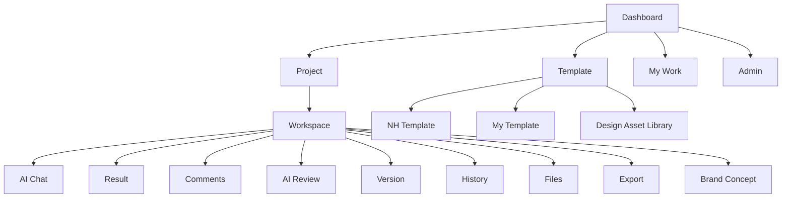

# IA & 화면 명세 v1.0

> **관련 문서**: [기능명세 인덱스](개발문서/기능명세/00_INDEX.md) | [PRD](개발문서/01_PRD.md)
>
> 기능별 동작 상세는 [기능명세](개발문서/기능명세/00_INDEX.md)로 분리했다. 본 문서는 IA · 화면 · 상태 모델의 정본이다.

## 1. IA

## 2. 핵심 화면
### S01 Dashboard
최근 프로젝트, 나의 작업, 검토 대기, 최근 Version, 최근 활동을 보여준다.

### S02 Project List
프로젝트명, 상태, 소유자, 마지막 활동, 멤버 수, 미처리 검토 건수를 표시한다.

### S03 Project Workspace
좌측: 파일/Template/멤버
~~중앙: 생성 결과물~~ → **중앙: 협업 디자인 캔버스** (2026-09-05 확장)
우측: ~~AI Chat/협업/AI 의견/AI 검토~~ → **속성/협업/AI 의견/AI 검토/AI Chat**
상단: Version/History/Export

#### 중앙 — 협업 디자인 캔버스

결과물을 "보여주기만 하는 영역"에서 "같이 만들어 가는 영역"으로 바꾼다.

| 구성 | 내용 |
|---|---|
| 화면 필름스트립 | 한 Version이 화면 여러 장을 가질 수 있다. 화면별 생성 상태(대기/생성중/완료/실패)와 실패 화면 재시도를 함께 노출한다 |
| 캔버스 | 샌드박스 iframe. **선택 모드**에서는 화면 위 HTML 요소를 클릭해 지목하고, **미리보기 모드**에서는 목업 안의 버튼을 눌러 다음 화면으로 이동한다 |
| 메모 핀 | 요소에 달린 의견을 그 요소 위에 번호 핀으로 겹쳐 보여준다 |
| 흐름 보기 | 화면 사이의 이동 관계를 노드-간선으로 그린다. 관계는 별도 테이블이 아니라 생성 HTML의 `data-goto` 속성에서 읽어낸다 |

**요소 = 임의의 HTML 요소**다(버튼·입력창·카드 등). 디자인시스템 컴포넌트 단위가 아니다.
이 구분은 중요하다 — 컴포넌트 카탈로그를 만드는 것이 아니라, 사람이 화면에서 손가락으로 가리키는 그 자리를 지목하게 하는 것이다. ([08 Q1](08_DECISIONS_OPEN_ISSUES.md) "이 서비스는 디자인 시스템인가? 아니다"와 충돌하지 않는 이유)

#### 우측 — 속성 패널 (신규)

요소를 고르면 자동으로 열린다. 태그·텍스트·화이트리스트된 스타일 값을 보여주고, 두 가지 방식으로 고칠 수 있다.

1. **직접 편집** — 텍스트·색·크기 등을 손으로 바꾼다.
2. **AI 재생성** — "이 버튼을 리스트로 바꿔줘"처럼 말하면 **선택한 요소만** 다시 만든다.

두 경우 모두 원본 HTML을 덮어쓰지 않고 **편집 패치로 쌓는다.** 누가 왜 바꿨는지가 남고 되돌릴 수 있다.

#### 우측 — 협업 패널에 섞이는 AI 카드 (2026-09-08 확장)

`협업`(의견) 탭은 사람 댓글만 담던 곳이었다. 여기에 [FR-15 UX 리스크 검토](개발문서/기능명세/FR-15_UX리스크검토.md)의 지적이 **같은 목록에 시간순으로 섞여** 놓인다.

| 구성 | 내용 |
|---|---|
| `AI에게 검토 요청` 버튼 | 패널 상단. **담당자가 누를 때만** 검토가 돈다. 자동 실행하지 않는다 |
| AI 카드 | 좌측 보더 + `AI` 표기로 사람 댓글과 구분한다. [근거 인용 → 사유 → 제안] 순, 결정 버튼 3종 |
| 메모 핀 번호 | **사람 댓글만 세어** 매긴다. AI 카드가 번호를 밀면 캔버스 위의 핀과 목록이 어긋난다 |
| 탭 배지 | `의견 (N)`의 N은 사람 댓글 수를 유지하고, 미결정 AI 지적이 있으면 점으로 표시한다 |

`AI 검토` 탭(FR-14)은 그대로 둔다. 화면만 보고 규칙으로 판정하는 검토와, 논의까지 읽고 누적을 보는 검토는 자리가 다르다.

### S04 AI Chat
입력 영역 + 참고자료 선택 + Template 선택 + 작업 유형 선택.

### S05 Result/Review
결과물 미리보기, 댓글, AI 의견 요약, 반영 선택을 한 화면에서 연결한다.

**AI 검토**([FR-14](개발문서/기능명세/FR-14_책임성검토.md))도 이 화면에 함께 놓인다. 지적 카드는 [근거 인용 → 사유 → 제안] 순으로 보여주고, 담당자는 **반영 / 보류 / 반려 / 준법 검토 요청**을 고른다. AI 제안(축별 좌측 보더 · `AI` 표기)과 사람의 결정(아바타 배지)을 시각적으로 구분한다.

**UX 리스크 검토**([FR-15](개발문서/기능명세/FR-15_UX리스크검토.md))는 별도 자리를 만들지 않고 **댓글 목록 안에** 놓인다. 논의에 의견을 하나 더 얹는 것이 이 기능의 요지이기 때문이다. 카드 형식은 같고 결정은 **반영 / 보류 / 반려** 3종이다 — `준법 검토 요청`은 FR-14 고유다.

### S06 Version
Version 목록, 현재 버전, 비교 대상 선택, 변경 요약, 관련 의견을 제공한다.

### S07 History
시간순 Timeline 형태로 사용자 작업, AI 작업, 댓글, 반영 결정, Version 생성 이력을 제공한다.

### S08 Brand Concept Brief
카드 실물·홍보물 시안을 요청하는 화면. 산출물 유형·규격 프리셋 선택, 브리프 입력(상품·캠페인명 / 타겟 / 전달할 느낌 / 필수 문구), 브랜드 자산 선택, 참고자료 선택으로 구성한다. 비디자이너가 채울 수 있도록 디자인 용어를 입력칸에 쓰지 않는다.

### S09 Concept Compare
생성된 시안 3개를 규격 비율을 유지한 채 나란히 비교하는 화면. 시안별 방향 라벨·확대 보기·개별 의견 등록을 제공하고, 하나를 선택하면 Version이 생성된다. 선택하지 않으면 Version은 만들어지지 않는다. 시안은 샌드박스 iframe으로 격리 렌더링한다.

화면 상세: [09_UI_SPEC_브랜드시안.md](개발문서/09_UI_SPEC_브랜드시안.md)

### S10 Design Asset Library
IA의 `D3`. NH가 보유한 디자인 자산을 **자산 종류별**(~~로고·워드마크~~ 로고·CI 기본요소 / 컴포넌트 / 화면 템플릿 / 컬러·타이포 토큰)로 한 화면에 펼쳐 보여준다. 각 자산은 출처(올원뱅크 / 기업인터넷뱅킹 / NH공통)와 **실물 보유 여부**를 배지로 표시하고, 자산을 프로젝트에 담아 AI 생성 컨텍스트로 넘기는 진입점을 제공한다.

이 화면의 목적은 자산 관리가 아니라 **"외부 AI와 달리 NH 자산에서 출발한다"는 제품 차별점을 눈으로 확인시키는 것**이다. 그래서 상단에 보유 자산 규모를 고정 배치한다. Template의 버전 선택·소유 구분(D1/D2)은 이 화면이 아니라 S03·S04에서 다룬다.

- 실물 자산이 없는 항목은 대체본(자리표시)을 그려 빈 칸을 만들지 않되, 배지로 실물과 명확히 구분한다.
- 실물 이미지 파일은 공개 서빙 대상에서 제외되는 경로에만 둔다. → [DEPLOYMENT.md](docs/architecture/DEPLOYMENT.md) 3절
- 농협 공식 CI(심볼마크·워드마크·전용색상·그래픽모티브)는 `로고·CI 기본요소`에 둔다. 전용색상 규격서의 PANTONE·RGB 값은 이미지와 별개로 코드에 옮겨 두어, 이미지가 없어도 토큰 카드가 정본 값을 보여준다.
- 관련 기능: [FR-04 Template](개발문서/기능명세/FR-04_템플릿.md)(`BRAND_ASSET`), [FR-13 브랜드 시안 제작](개발문서/기능명세/FR-13_브랜드시안제작.md)

## 3. 상태 모델
### AI Job
REQUESTED → PROCESSING → COMPLETED / FAILED / CANCELLED

### Comment/Review
OPEN → REVIEWED → ACCEPTED / REJECTED / DEFERRED

### Responsibility Review (FR-14)
검토 실행: RUNNING → DONE / FAILED
지적 결정: (미결정) → ACCEPTED / DEFERRED / REJECTED / COMPLIANCE_REQUESTED

`COMPLIANCE_REQUESTED`가 Comment/Review 상태 모델과 다른 지점이다. AI도 담당자도 판단하지 않고 준법 담당자에게 넘기는 상태다. → ❓ 수신자·알림·SLA 미결

### Usability Review (FR-15)
검토 실행: RUNNING → DONE / FAILED
지적 결정: (미결정) → ACCEPTED / DEFERRED / REJECTED

FR-14와 실행 상태는 같고 **결정에 `COMPLIANCE_REQUESTED`가 없다.** 준법 축은 FR-14의 몫이다.
검토는 담당자 요청 시에만 시작되므로 `REQUESTED` 대기 상태를 따로 두지 않는다.

### Project
DRAFT → ACTIVE → REVIEW → COMPLETED → ARCHIVED

## 4. 핵심 UX 원칙
- AI 제안과 사람의 최종 결정을 시각적으로 구분한다.
- Version과 History를 같은 화면에서 연결한다.
- 사용자가 “왜 바뀌었는지”를 두 번 이상 클릭하지 않고 확인할 수 있게 한다.
- 프로젝트의 현재 상태와 다음 액션을 항상 보여준다.
- 파일/의견/Version을 프로젝트 단위로 묶어 검색 가능하게 한다.
