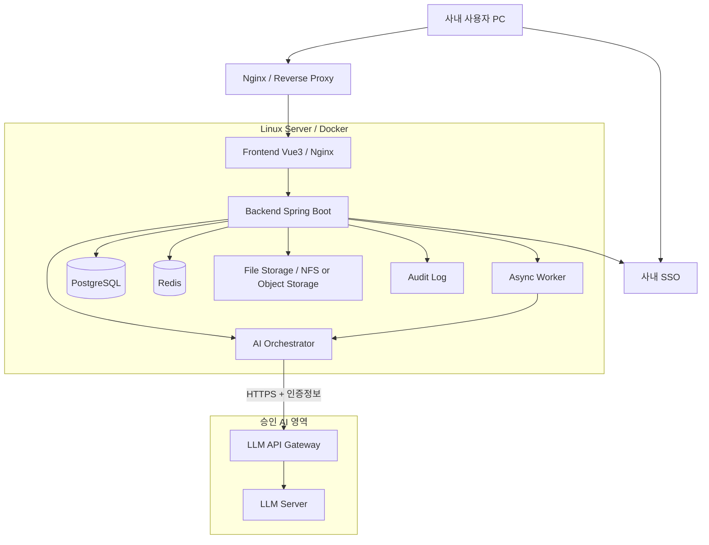
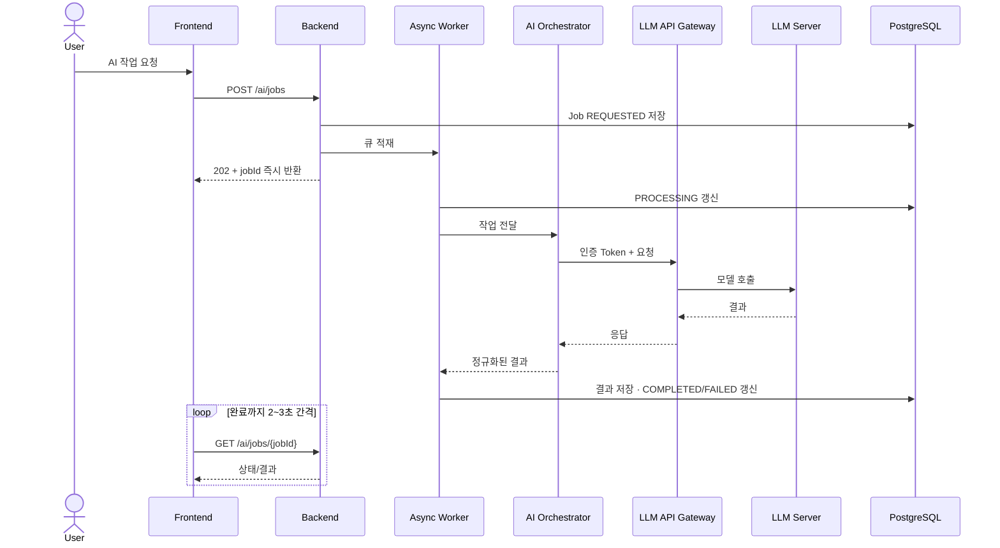

# NH뚝딱협업스튜디오 시스템 아키텍처 v1.0

## 1. 목표 배포 환경
- 농협은행 내부 Linux 서버
- Docker 컨테이너 기반 배포
- 승인된 LLM 서버는 API 방식으로 연계
- 사용자 브라우저에서 LLM 직접 호출 금지
- 향후 K8s 전환을 고려한 stateless 애플리케이션 구조

## 2. 논리 구성

## 3. 컴포넌트 책임
### Frontend
화면/상태 표시, 파일 선택, Chat 입력, 협업 UI, Version/History 시각화.

### Backend
인증/인가, 프로젝트 도메인, 파일 메타데이터, 협업, Version, History, Export orchestration, API 제공.

### AI Orchestrator
LLM API 표준화, 인증정보 주입, 프롬프트 구성, 모델 라우팅, timeout/retry, 오류 정규화, 사용량 메타데이터 관리.

### Async Worker
장시간 문서 분석/생성/Export 작업을 큐 기반으로 처리할 확장 지점.

### PostgreSQL
프로젝트, 사용자, 멤버, 댓글, Review, Version, History, Template 메타데이터를 저장.

### Redis
세션/캐시/작업 상태 등 용도로 사용. 실제 운영 목적은 인프라 협의 후 확정.

### File Storage
원본 참고자료와 Version별 생성 산출물을 DB와 분리해 저장.

## 4. AI 호출 흐름

LLM 호출 경로는 두 가지로 구분한다. 어느 경우든 브라우저는 LLM을 직접 호출하지 않는다.

| 경로 | 대상 | 흐름 |
|---|---|---|
| 동기 단건 | 화면 1장 생성, 요소 AI 편집처럼 단일 응답으로 끝나는 호출 ([05_API_DB_SPEC.md](05_API_DB_SPEC.md) 3-2절) | FE → BE → AO → GW. 여러 건 팬아웃은 클라이언트가 한다 |
| 비동기 Job | 문서 분석, 시안 3안 생성, Export 등 장시간 작업 | FE → BE(Job 등록 후 즉시 202) → 큐 → Async Worker → AO → GW |

비동기 Job의 상태 전달은 폴링으로 한다(`GET /ai/jobs/{jobId}`, 권장 주기 2~3초). 초기 사용자 규모에서 SSE/WebSocket은 운영 비용이 이득보다 크므로 도입하지 않고, 규모 확대 시 재검토한다.

~~이전 다이어그램은 Backend가 LLM 응답까지 받은 뒤 Frontend에 반환하는 동기 흐름이었다~~ → 비동기 Job 결정([ARCHITECTURE.md](../docs/architecture/ARCHITECTURE.md) 4절)과 모순되어 수정 (2026-09-06).

## 5. 보안 원칙
- SSO/사내 인증을 Backend에서 검증
- LLM credential은 Secret/보안 저장소 등 허용된 방식 사용
- 프론트 번들에 credential 포함 금지
- 프로젝트별 파일 접근권한 확인
- 로그에 원문/민감정보를 기본 저장하지 않음
- AI 요청 대상 자료를 사용자가 명시적으로 선택할 수 있게 함
- 파일 업로드 시 확장자/바이러스/용량 정책 적용

## 6. 안정성
- LLM timeout/retry/circuit-breaker 고려
- 장시간 작업 비동기 처리
- 실패 작업 재시도 가능, 진행 중 작업 취소 가능(`POST /ai/jobs/{jobId}/cancel`)
- 중복 요청 idempotency 고려
- DB/파일 간 불일치 복구 절차 필요
- 파일 업로드/다운로드는 Backend 경유 스트리밍으로 처리해 요청 스레드 장기 점유를 피하고, 용량 상한 초과는 413으로 즉시 거절

## 7. 확장성
초기에는 Docker 단일/소수 컨테이너로 구성하되, Frontend/Backend/AI Worker를 stateless하게 설계한다. 향후 NH K8s 환경으로 전환할 경우 Deployment/Service/Ingress/PVC 등으로 분리하기 쉽도록 이미지와 환경변수를 명확히 관리한다.
