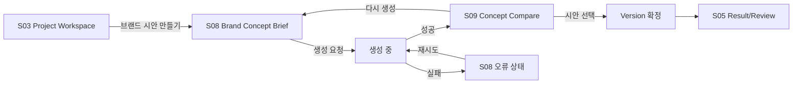

# 09 · 브랜드 시안 화면 상세 명세 (S08 · S09) v1.0

> **관련 문서**: [FR-13 브랜드 시안 제작](개발문서/기능명세/FR-13_브랜드시안제작.md) | [IA·화면 정본](개발문서/03_IA_FUNCTION_SPEC.md) | [PRD](개발문서/01_PRD.md)
>
> **정본 관계**: 화면 목록과 역할의 정본은 [03_IA_FUNCTION_SPEC.md](개발문서/03_IA_FUNCTION_SPEC.md)다. 본 문서는 그 S08·S09를 **화면 제작에 넘길 수 있는 수준**으로 상세화한 것이다. 03이 바뀌면 본 문서를 함께 갱신한다.

## 0-0. 확인할 수 있는 곳

| 형태 | 위치 | 성격 |
|---|---|---|
| 정적 클릭스루 | `mockup-site/brand-concept-brief.html` → `brand-concept-compare.html` → `brand-concept-decided.html` | 팀 공유용. GitHub Pages `/dev/`에 그대로 배포된다. JS 없이 링크로만 이동하는 기존 목업 사이트 규칙을 따른다 |
| 동작 프로토타입 | Claude Design 캔버스 (S08·S09 + S09 대안 2안) | 유형 전환·키워드 선택·확대 보기·결정 확인 단계까지 실제로 눌러볼 수 있다. 저장소에는 포함하지 않는다 |

## 0. 이 문서를 읽는 사람에게

이 화면을 쓰는 사람은 **전원 비디자이너**다 — 카드 상품 기획자, 마케팅/홍보 담당자, 영업점·부서 실무자. 이들은 디자인 용어를 쓰지 않고, 자기가 원하는 걸 시각적으로 설명하지 못한다.

그래서 이 화면의 목표는 **"좋은 디자인을 뽑는 것"이 아니라 "디자인 얘기가 말로만 끝나는 걸 막는 것"**이다. 설계 판단이 갈릴 때는 항상 이 기준으로 정한다.

| 원칙 | 화면에서의 의미 |
|---|---|
| 디자인 용어를 요구하지 않는다 | "여백", "커닝", "그리드" 같은 말을 입력칸에 쓰지 않는다. "전달할 느낌"처럼 업무 언어로 묻는다 |
| 비교가 본체다 | 잘 만든 하나보다, 방향이 다른 셋을 나란히 놓는 것이 이 화면의 값이다 |
| 고르는 순간이 의사결정이다 | 선택은 되돌릴 수 있는 UI 조작이 아니라 **기록되는 결정**이다. 그렇게 보이게 만든다 |
| AI 제안과 사람 결정을 시각적으로 구분한다 | [03 4절 UX 원칙](개발문서/03_IA_FUNCTION_SPEC.md) 계승 |

---

## 1. 화면 흐름

- 진입점은 S03 Project Workspace다. 새 화면 계층을 만들지 않고 기존 워크스페이스 안에 둔다.
- S09에서 **선택하지 않으면 Version이 생기지 않는다.** 이것이 이 흐름의 핵심 규칙이다.

---

## 2. S08 — Brand Concept Brief

### 2-1. 역할

무엇을 만들지 AI에게 설명하는 화면. 입력칸 하나하나가 결과 품질을 좌우하므로, **비디자이너가 채울 수 있는 질문**으로만 구성한다.

### 2-2. 구성 요소

| # | 요소 | 형태 | 필수 | 비고 |
|---|---|---|---|---|
| 1 | 산출물 유형 | 2택 카드형 선택 (카드 실물 / 홍보물) | 필수 | 선택에 따라 2번 프리셋 목록이 바뀐다 |
| 2 | 규격 | 프리셋 선택 (썸네일에 비율 도형 표시) | 필수 | 카드 → `CARD_H`·`CARD_V` / 홍보물 → `POSTER_A`·`BANNER_SQ` |
| 3 | 상품·캠페인명 | 한 줄 입력 | 필수 | 예: "NH 청년 우대 체크카드" |
| 4 | 타겟 | 한 줄 입력 | 선택 | 예: "사회초년생 20대 후반" |
| 5 | 전달할 느낌 | 키워드 칩 입력 (직접 입력 + 추천 칩) | 필수 | **디자인 용어를 묻지 않는 칸.** 추천 칩 예: 신뢰감 · 젊은 · 따뜻한 · 프리미엄 · 깔끔한 · 활기찬 |
| 6 | 꼭 들어갈 문구 | 여러 줄 입력 | 선택 | 상품명 외 슬로건·필수 고지 문구 |
| 7 | 브랜드 자산 | 다중 선택 목록 | 필수 | `template_type = BRAND_ASSET`. 로고·컬러 세트·서체 규칙 |
| 8 | 참고자료 | 다중 선택 목록 | 선택 | 프로젝트에 업로드된 파일 ([FR-03](개발문서/기능명세/FR-03_참고자료.md)) |
| 9 | 생성 버튼 | 주 버튼 | — | 라벨: **"시안 3개 만들기"** |

### 2-3. 반드시 화면에 있어야 하는 안내

AI가 이미지를 만들지 못한다는 사실을 **사용자가 결과를 보기 전에** 알아야 한다. 이걸 숨기면 "왜 사진이 안 나오죠?"가 반복된다.

> 브랜드 자산 선택 영역 하단 고정 안내
> **"로고·캐릭터 같은 그림 요소는 위에서 고른 자산만 사용됩니다. AI가 새 그림을 그리지는 않습니다."**

### 2-4. 상태

| 상태 | 화면 |
|---|---|
| 기본 | 산출물 유형만 선택된 상태. 나머지는 비활성 또는 접힘 |
| 입력 부족 | 생성 버튼 비활성 + 미충족 필수 항목 인라인 표시 |
| 브랜드 자산 없음 | 목록 자리에 빈 상태: **"등록된 브랜드 자산이 없습니다. 자산 없이 만들면 NH 색·로고가 반영되지 않습니다."** + 그대로 진행 가능 |
| 생성 중 | 생성 버튼 비활성 + 진행 표시. Job 상태 `REQUESTED → PROCESSING`을 그대로 노출 |
| 실패 | 인라인 오류 + 원인 요약 + **재시도** 버튼. 입력값은 유지한다 |

### 2-5. 오류 문구 규칙

내부 정보(스택 트레이스·DB·경로)를 노출하지 않는다. HTTP 코드별 사용자 문구:

| 코드 | 문구 |
|---|---|
| 429 | "지금 AI 요청이 몰려 있습니다. 잠시 후 다시 시도해 주세요." |
| 502 / 504 | "AI 연결에 실패했습니다. 입력하신 내용은 그대로 있습니다. 다시 시도해 주세요." |
| 422 | "입력 내용으로는 시안을 만들 수 없습니다. 전달할 느낌을 한 가지 이상 넣어 주세요." |

근거: [ARCHITECTURE.md](docs/architecture/ARCHITECTURE.md) 9절 · [05_API_DB_SPEC.md](개발문서/05_API_DB_SPEC.md) 7절

---

## 3. S09 — Concept Compare

### 3-1. 역할

**이 제품에서 가장 중요한 한 화면.** 서로 다른 방향 3개를 나란히 놓고, 팀이 의견을 붙이고, 한 방향을 고른다. 고르는 행위가 곧 의사결정 기록이 된다.

### 3-2. 구성 요소

| # | 요소 | 형태 | 비고 |
|---|---|---|---|
| 1 | 시안 3개 | 가로 3열 나란히 배치 | 각 시안은 규격 비율을 유지한 캔버스 |
| 2 | 방향 라벨 | 각 시안 상단 | `variant_label` (예: "정통·신뢰형") |
| 3 | 방향 설명 | 라벨 아래 1~2줄 | AI가 왜 이 방향인지 설명. **AI 제안임이 시각적으로 구분되어야 한다** |
| 4 | 확대 보기 | 각 시안 액션 | 단일 시안 전체화면 |
| 5 | 의견 달기 | 각 시안 액션 | [FR-06](개발문서/기능명세/FR-06_협업의견.md) 재사용. 시안별로 의견이 분리된다 |
| 6 | 의견 수 배지 | 각 시안 | 어느 방향에 논의가 몰렸는지 한눈에 |
| 7 | **이 방향으로 결정** | 각 시안의 주 버튼 | 누르면 Version 생성 |
| 8 | 다시 생성 | 보조 버튼 | S08으로 입력값을 안고 복귀 |

### 3-3. 시안 렌더링 — 보안 필수 사항

AI 생성 HTML을 화면에 넣는 지점이다. **이 규칙은 협상 대상이 아니다.**

- 각 시안은 **샌드박스 iframe**으로 격리해 렌더링한다.
- `sandbox` 속성에 `allow-same-origin`과 `allow-scripts`를 **동시에 부여하지 않는다.**
- 부모 페이지에 `innerHTML` / `dangerouslySetInnerHTML`로 직접 주입하지 않는다.

근거: [SECURITY_CHECKLIST.md](docs/guidelines/SECURITY_CHECKLIST.md) 4절 · [FR-05](개발문서/기능명세/FR-05_AI제작.md) 2절. FR-13은 이 정책을 새로 만들지 않고 그대로 따른다.

### 3-4. 선택 = 의사결정

선택 버튼은 일반적인 UI 토글처럼 보이면 안 된다. **기록이 남는 결정**임이 드러나야 한다.

- 누르면 확인 단계를 한 번 둔다: **"이 방향으로 결정하면 Version 1이 만들어지고, 결정 기록이 History에 남습니다."**
- 확인 시: `versions` 1행 생성 (`source_type = AI_GENERATION`, `source_job_id` 연결) → S05 Result/Review로 이동
- **선택하지 않은 나머지 2안은 Version이 되지 않는다.** 후보로 Job 결과에만 남는다.
- 선택 이유를 선택적으로 입력받는다(한 줄). 입력하면 Version `summary`와 History에 함께 남는다.

### 3-5. 상태

| 상태 | 화면 |
|---|---|
| 기본 | 3안 나란히, 아직 아무것도 선택되지 않음 |
| 일부 생성 실패 | 성공한 시안만 표시 + 실패 자리에 사유와 재시도. **전체를 실패로 처리하지 않는다** |
| 전체 실패 | S08 오류 상태로 되돌리고 입력값 유지 |
| 선택 완료 | 선택된 시안에 결정 표식. 나머지는 "검토한 후보"로 흐리게 유지 (지우지 않는다) |
| 권한 없음 | 조회는 되고 선택·의견 등록 액션이 숨겨진다 ([FR-01](개발문서/기능명세/FR-01_인증권한.md)) |

### 3-6. 반응형

- 넓은 화면: 3열 나란히 — **기본이자 이 화면의 존재 이유**
- 좁은 화면: 가로 스크롤 유지. **세로로 쌓지 않는다.** 세로로 쌓으면 비교라는 목적 자체가 사라진다.

---

## 4. 화면 밖으로 남기는 것

아래는 본 명세에서 정의하지 않는다. 임의로 만들지 말 것.

| 항목 | 이유 |
|---|---|
| 브랜드 자산 **등록·관리** 화면 | [00_INDEX.md](개발문서/기능명세/00_INDEX.md)에서 Template 관리 화면이 ❓ 미정의로 남아 있다. S08은 **선택 UI만** 정의한다 |
| 시안 Export 화면 | Export 형식(PNG/PDF/HTML)이 미결 ([08_DECISIONS_OPEN_ISSUES.md](개발문서/08_DECISIONS_OPEN_ISSUES.md)) |
| 시안 직접 편집 기능 | 컨셉 시안 범위를 넘는다. 수정은 대화형 재생성으로만 한다. **(2026-09-05 주석)** S03 작업공간의 화면 목업에는 요소 단위 직접 편집이 도입됐다([03_IA_FUNCTION_SPEC.md](03_IA_FUNCTION_SPEC.md) S03). 이 항목은 **번복되지 않았다** — 브랜드 시안(S08·S09)에 한정해 그대로 유지한다. 이유: 컨셉 시안은 "세 방향 중 하나를 고르는" 것이 목적이라 개별 수정이 비교를 흐린다. 화면 목업은 반대로 "하나를 함께 다듬는" 것이 목적이다 |
| 인쇄 규격 입력(mm·CMYK·재단선) | 컨셉 시안 범위 밖 ([FR-13](개발문서/기능명세/FR-13_브랜드시안제작.md) 1절) |
